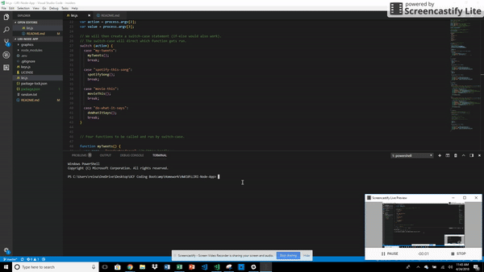
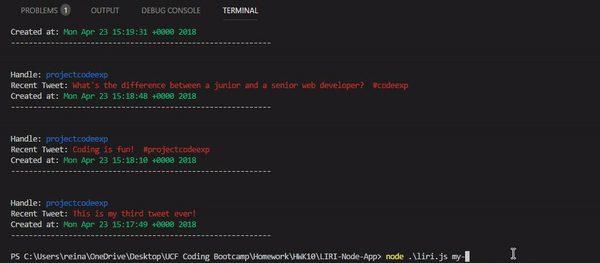
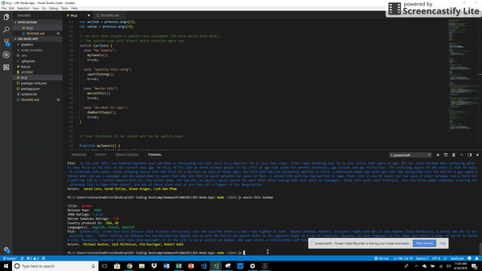

# LIRI-Bot

### Overview

For this project, I created a LIRI. LIRI is like iPhone's SIRI. However, while SIRI is a Speech Interpretation and Recognition Interface, LIRI is a _Language_ Interpretation and Recognition Interface. LIRI will be a command line node app that takes in parameters and gives you back data.  It utilizes four Node packages (Twitter, Node-Spotify-API, Request, and DotEnv).  The OMDB API will be accessed using the Node package Request.  Your credentials to access each API or apps will be safeguarded using the [DotEnv](https://www.npmjs.com/package/dotenv) package. I have made it so liri.js can take in one of the following commands:

1. `node liri.js my-tweets` - This command will tell LIRI to display my last 20 tweets and when they were created at in your terminal/bash window without displaying my personal login information or password. It uses [Twitter](https://www.npmjs.com/package/twitter).

2. `node liri.js spotify-this-song '<song name here>'` - This command will tell LIRI to utilize the [node-spotify-api](https://www.npmjs.com/package/node-spotify-api) package in order to retrieve song information from the Spotify API.  This will show the following information about the song in your terminal/bash window: 
   
    * Artist(s)
    * The song's name
    * A preview link of the song from Spotify
    * The album that the song is from
    * If no song is provided then your program will default to "The Sign" by Ace of Base.

3. `node liri.js movie-this '<movie name here>'` - Using the [Request](https://www.npmjs.com/package/request) Node package to grab data from the [OMDB API](http://www.omdbapi.com), this command will tell LIRI to output the movie information below to your terminal/bash window, but if the user doesn't type a movie in, the program will output data for the movie 'Mr. Nobody.'.

    * Title of the movie.
    * Year the movie came out.
    * IMDB Rating of the movie.
    * Rotten Tomatoes Rating of the movie.
    * Country where the movie was produced.
    * Language of the movie.
    * Plot of the movie.
    * Actors in the movie.

4. `node liri.js do-what-it-says` - Using the `fs` Node package, LIRI will take the text inside of random.txt and then use it to call one of LIRI's commands.  It will run `spotify-this-song` for "I Want it That Way," as it is the text listed in the `random.txt` file.
 

#Video Recording

* Below is a full recording of my project as well. 
[My Video](graphics/myvideo.mp4)